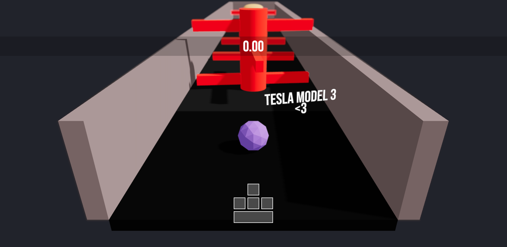

# 3D Game - THREE.JS and REACT THREE FIBER

With ThreeJS Journey course, i made this 3D game with React Three Fiber.  
You can play with thid [DEMO](https://tom-cest-trivial.vercel.app)



## How to play

The goal of the game is to go to the end of the maze, touch the big hamburger and dodge the obstacles. For that :

- Use the arrow keys to move
- Use the space bar to jump


## How to install

For play with this project and use it localy, you need to :

- Clone this repository  

- Install dependencies with :  

```bash
npm install
#or
yarn install
#or
pnpm install
```

- Run the project with `npm start`  

```bash
npm run dev
#or
yarn dev
#or
pnpm dev
```

- Go to `http://localhost:3000`
